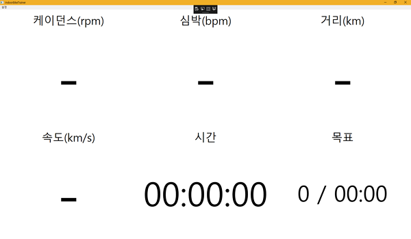

# C# WPF Grid layout 예제

C# WPF 로 화면 구성시 Grid로 레이아웃 구성하는 방법

```
<Grid>
    <Grid.ColumnDefinitions>
        <ColumnDefinition Width="1*"/>
        <ColumnDefinition Width="1*"/>
        <ColumnDefinition Width="1*"/>
    </Grid.ColumnDefinitions>
    <Grid.RowDefinitions>
        <RowDefinition Height="1*"/>
        <RowDefinition Height="4*"/>
        <RowDefinition Height="1*"/>
        <RowDefinition Height="4*"/>
    </Grid.RowDefinitions>
    <Label Grid.Column="0" Grid.Row="0" x:Name="lblCadence" Content="케이던스(rpm)" FontSize="50" HorizontalAlignment="Center" VerticalAlignment="Bottom"/>
    <TextBlock Grid.Column="0" Grid.Row="1" x:Name="txtCadnece" TextWrapping="Wrap" Text="-" FontSize="250" TextAlignment="Center" HorizontalAlignment="Center" VerticalAlignment="Center"/>
    <Label Grid.Column="0" Grid.Row="2" x:Name="lblSpeed" Content="속도(km/s)" FontSize="50" HorizontalAlignment="Center" VerticalAlignment="Bottom"/>
    <TextBlock Grid.Column="0" Grid.Row="3" x:Name="txtSpeed" TextWrapping="Wrap" Text="-" FontSize="250" TextAlignment="Center" HorizontalAlignment="Center" VerticalAlignment="Center"/>
    <Label Grid.Column="1" Grid.Row="0" x:Name="lblHeartBeatRate" Content="심박(bpm)" FontSize="50" HorizontalAlignment="Center" VerticalAlignment="Bottom"/>
    <TextBlock Grid.Column="1" Grid.Row="1" x:Name="txtHeartBeatRate" TextWrapping="Wrap" Text="-" FontSize="250" TextAlignment="Center" HorizontalAlignment="Center" VerticalAlignment="Center"/>
    <Label Grid.Column="1" Grid.Row="2" x:Name="lblTime" Content="시간" FontSize="50" HorizontalAlignment="Center" VerticalAlignment="Bottom"/>
    <TextBlock Grid.Column="1" Grid.Row="3" x:Name="txtTime" TextWrapping="Wrap" Text="00:00:00" FontSize="150" TextAlignment="Center" HorizontalAlignment="Center" VerticalAlignment="Center"/>
    <Label Grid.Column="2" Grid.Row="0" x:Name="lblDistance" Content="거리(km)" FontSize="50" HorizontalAlignment="Center" VerticalAlignment="Bottom"/>
    <TextBlock Grid.Column="2" Grid.Row="1" x:Name="txtDistance" TextWrapping="Wrap" Text="-" FontSize="250" TextAlignment="Center" HorizontalAlignment="Center" VerticalAlignment="Center"/>
    <Label Grid.Column="2" Grid.Row="2" x:Name="lblRemain" Content="목표" FontSize="50" HorizontalAlignment="Center" VerticalAlignment="Bottom"/>
    <TextBlock Grid.Column="2" Grid.Row="3" x:Name="txtRemain" TextWrapping="Wrap" Text="0 / 00:00" FontSize="100" TextAlignment="Center" HorizontalAlignment="Center" VerticalAlignment="Center"/>
</Grid>
```


