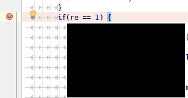
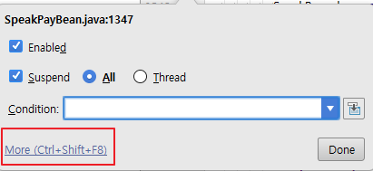
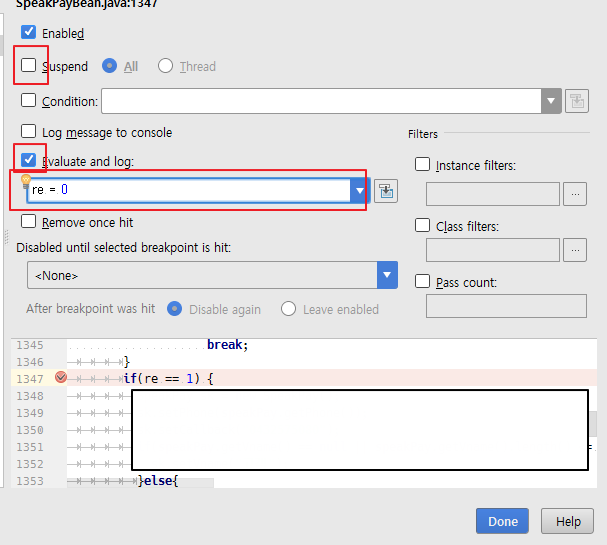

# Intellij Debugging시 line skip하기
java개발 중 특정 라인(인증 관련 코드들)을 건너뛰어야 할 경우가 필요해서 자료를 찾아보니
특정 라인을 지정해서 무조건 건너 뛸수는 없고, 특정 조건값을 통해 if문을 우회할 수 있는 방법이 있었다.

## breakpoint 토글

## breakpoint 오른쪽버튼 클릭

## 세팅화면
* Uncheck suspend
* Check Evaluate and log
* 조건을 건너뛸 값 입력

위와 같이 세팅하면 re 값이 1로 세팅되어 if문을 건너뛰고 실행된다.
